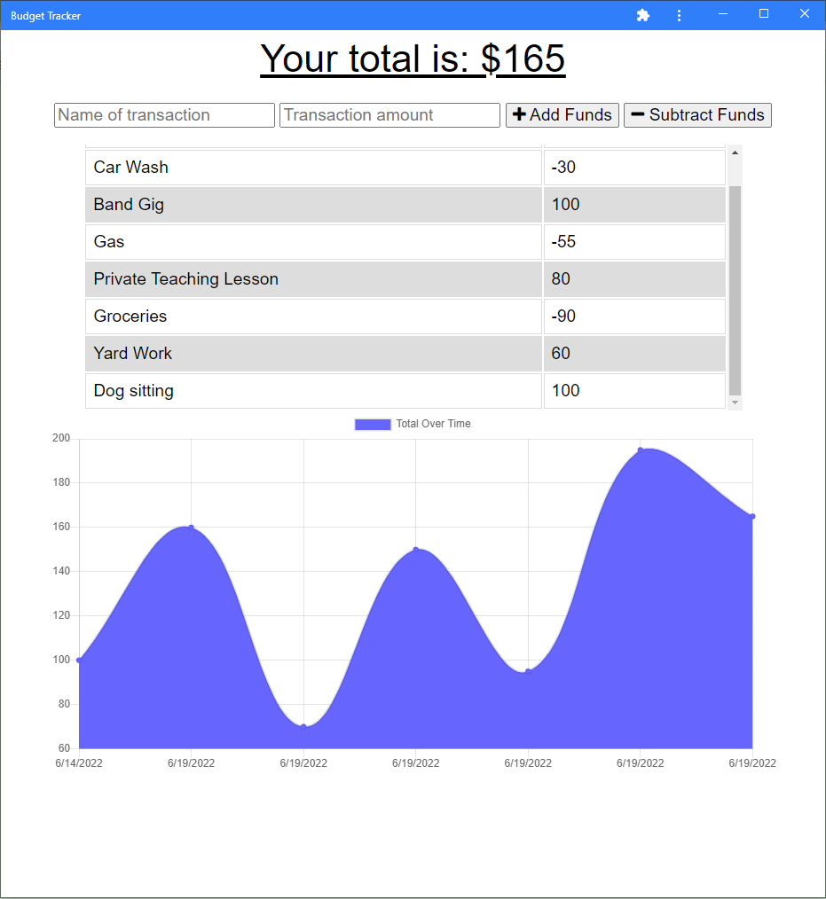

# Budget Tracker - Offline Feature Update

Creating offline capabilities for an existing budget tracker application.

## Description

This project updates a budget tracker to allow for offline access and functionality. A user is able to add expenses and deposits to their budget regardless of thier internet connection.

## Installation

Visit the Budget Tracker [website](Heroku link here).

## Usage

Add a transaction amount with the name of the transaction and it will be added to the list of transactions on the page. As more transactions are added, a line graph representing your total amount from transactions will update allowing you to see your budget change over time.

As this project was made to add offline funcionality, try turning off network connection (through the _Network_ tab in Google's Dev Tools, for example) then adding transactions. Though the page won't update (due to being offline), the transactions are being tracked, which can be confirmed by checking the "IndexedDB" group under _Storage_ in Google's Dev Tools where you will find your transactions stored. Once internet connection has been reestablished, the transactions will automatically be loaded and update the page. Thus, this budget tracker application is now functional even offline!

## Technologies Used

- Express.js
- Node.js
- IndexedDB
- Heroku
- MongoDB
- Mongoose

## Credits

Budget-App (starter code) created by [Xandromus](https://github.com/Xandromus).
Offline functionality created by myself, [mfcodingbc](https://github.com/mfcodingbc)

## License

[MIT](https://choosealicense.com/licenses/mit/)
